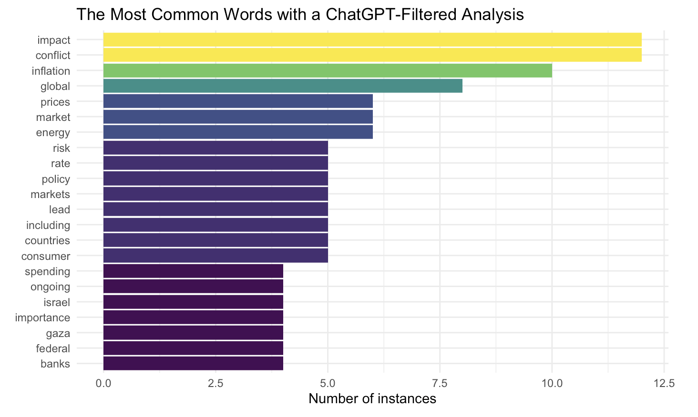

```{r setup, include = FALSE}
# Set code chunk defaults 
# Consider adding `message = FALSE` option
knitr::opts_chunk$set(echo = FALSE, warning= FALSE) #means code will not be displayed by default, need to set echo=true in a specific chunk for this to happen. 
                      
# Set R environment options
options(knitr.kable.NA = '')

# Load packages
library(tidyverse)
library(tidytext)
library(wordcloud)
library(textdata)
library(tidyverse)
library(rvest)
library(httr)
library(stringr)
library(plotly)
library(dplyr)
library(ggplot2)
library(tidytext)
library(wordcloud)
library(textdata)
library(tidyverse)
library(rvest)
library(httr)
library(stringr)
library(jsonlite)
library(readxl)
library(tm)
library(tidytext)
library(wordcloud)
library(textdata)
library(tidyverse)
library(stringr)
library(leaflet)
library(tidygeocoder)
library(sf)
library(ggplot2)
library(mapproj)
library(maps)
library(dplyr)
library(viridis)
library(purrr)
library(zoo)
library(DT)

```

# Intro

The world runs on energy, and for the last 2 centuries, a major source of the worlds energy has been oil. Historically, it has been an incredibly profitable industry. Today, oil and gas provide [80%](https://www.energy.gov/articles/economic-impact-oil-and-gas#:~:text=Lower%20energy%20costs%2C%20driven%20by,energy%20in%20the%20United%20States.) of American energy, and provide >12 million American jobs. A similar trend is followed globally, with few exceptions. As a result of the prominence of oil and gas within each nation-state's energy consumption profile, it is a sought after commodity. Many conflicts both prior and current revolve around, or have implications relating to access to energy resources. A period specific example would be the most recent outbreak of the Russia-Ukraine war, beginning in February 2022. As a result of the re-kindling of this conflict, many European nations that were formerly served by Russian oil/gas had to find new sources of energy, as it was no longer an option to purchase from Russia given the nation's encroachment upon Ukraine's sovereignty. 

This blog will provide further analysis of the impact that global conflicts have on the movement of energy resources, the price of energy resources, and the subsequent increases of prices for consumers.

# Content

```{r fig.align="left", out.width="100%"}


#Load Data

file_path <- "data/JamieDimonCNBCInterview.txt"

# Read the text file into a data frame with one column named "Paragraph"
JamieDimonCNBCInterview <- read_lines(file_path) %>%
  tibble(Paragraph = .)

# Separate each paragraph into words and unnest the data frame
JamieDimonCNBCInterview <- JamieDimonCNBCInterview %>%
  mutate(Word = str_split(Paragraph, "\\s+")) %>%
  unnest(Word) %>%
  select(Word)

file_path2 <- "data/JpowellSemiAnnualAddress.txt"

JPowellSemiAnnualAddress <- read_lines(file_path2) %>%
  tibble(Paragraph = .)

JPowellSemiAnnualAddress <- JPowellSemiAnnualAddress %>%
  mutate(Word = str_split(Paragraph, "\\s+")) %>%
  unnest(Word) %>%
  select(Word)

file_path3 <- "data/MichaelBarrTreasuryMarket.txt"

MichaelBarrTreasury <- read_lines(file_path3) %>%
  tibble(Paragraph = .)

MichaelBarrTreasury <- MichaelBarrTreasury%>%
  mutate(Word = str_split(Paragraph, "\\s+")) %>%
  unnest(Word) %>%
  select(Word)

file_path4 <- "data/BloombergWarArticle.txt"

BloombergArticle <- read_lines(file_path4) %>%
  tibble(Paragraph = .)

BloombergArticle <- BloombergArticle%>%
  mutate(Word = str_split(Paragraph, "\\s+")) %>%
  unnest(Word) %>%
  select(Word)

file_path5 <- "data/BrookingsArticle.txt"

BrookingsArticle <- read_lines(file_path5) %>%
  tibble(Paragraph = .)

BrookingsArticle <- BrookingsArticle%>%
  mutate(Word = str_split(Paragraph, "\\s+")) %>%
  unnest(Word) %>%
  select(Word)

file_path6 <- "data/DODArticle.txt"

DODArticle <- read_lines(file_path6) %>%
  tibble(Paragraph = .)

DODArticle <- DODArticle%>%
  mutate(Word = str_split(Paragraph, "\\s+")) %>%
  unnest(Word) %>%
  select(Word)

file_path7 <- "data/CnnArticle.txt"

CnnArticle <- read_lines(file_path7) %>%
  tibble(Paragraph = .)

CnnArticle <- CnnArticle%>%
  mutate(Word = str_split(Paragraph, "\\s+")) %>%
  unnest(Word) %>%
  select(Word)

file_path8 <- "data/JPMarticle2.txt"

JPMarticle2 <- read_lines(file_path8) %>%
  tibble(Paragraph = .)

JPMarticle2 <- JPMarticle2%>%
  mutate(Word = str_split(Paragraph, "\\s+")) %>%
  unnest(Word) %>%
  select(Word)

file_path9 <- "data/NYTArticle.txt"

NYTArticle <- read_lines(file_path9) %>%
  tibble(Paragraph = .)

NYTArticle <- NYTArticle%>%
  mutate(Word = str_split(Paragraph, "\\s+")) %>%
  unnest(Word) %>%
  select(Word)

file_path10 <- "data/GoldmanArticle.txt"

GoldmanArticle <- read_lines(file_path10) %>%
  tibble(Paragraph = .)

GoldmanArticle <- GoldmanArticle%>%
  mutate(Word = str_split(Paragraph, "\\s+")) %>%
  unnest(Word) %>%
  select(Word)

 data(stop_words)

 #Wrangle data
combined_df <- rbind(JamieDimonCNBCInterview, JPowellSemiAnnualAddress, MichaelBarrTreasury,
                     BloombergArticle, BrookingsArticle, DODArticle, CnnArticle, JPMarticle2, GoldmanArticle)|>
  mutate(Word = tolower(Word)) |>#makes everything lowercase
  rename(word = Word)|>
  mutate(word = str_replace_all(word, "[^a-z'-]", "")) #makes it so there's no punctuation included in the dataframe       aside from ', -. 
  
words_to_remove <- c("leslie", "picker", "kelly","jamie", "dimon", "portant", "dont", "lot", "im", "stuff") #gets rid of other random words we don't want included

for (wordReplace in words_to_remove) {#uses loop to check if words in combined df are a match from words_to_remove, replaces them with blank strings if they are
  combined_df <- combined_df %>%
    mutate(word = str_replace_all(word, wordReplace, ""))
}

combined_df<- combined_df |>
    filter(nchar(word)>0) |>#removes the blank strings
    anti_join(stop_words, by="word") #removes stop words

word_counts <- combined_df |> #creates the counts, orders by descending
  group_by(word) |>
  summarize(count = n()) |>
  group_by(count) |>
  arrange(desc(count))
```

## Word Search

First, we employed two approaches of sentiment analysis on news articles to explore the impact of global conflict on oil. We sought out articles relating to a series of key words that are relevant to our topic of interest (oil). These articles were found through using a few different key word searches such as: "Israel-Gaza Conflict", "Global Macroeconomic Environment", "Economic Impact of war" and "How war impacts national economies". After performing these searches, we selected articles that had recent publication dates. We took care to include articles from different institutions such as Governments/National Banks, News Media groups, and high ranking individuals in the private sector. First, we explored the most used words across the articles.  

```{r fig.align="left", out.width="100%"}
Visual1Data <- word_counts |>
  filter(count>25)

ggplot(data = Visual1Data, aes(x = fct_reorder(word, count), y = count, fill = count)) +
  geom_col() +
  coord_flip() +
  scale_fill_viridis_c() +
  guides(fill = "none") +
  labs(
    x = NULL,
    y = "Number of instances",
    title = "The Most Common Words in Documents Relating to War and Economics")+
  theme_minimal()


```
The output of this analysis gave us insight into the sentiment of the media, national governments, as well as the private sector. Obviously, an article from Bloomberg is going to be more likely to contain the words 'inflation' 'market' or 'economy' than an Emily Dickinson Poem, but seeing the other words that also appear in tandem with the aforementioned and viewing the output holistically still gives us a unique takeaway. That is: among all these economy related terms - oil is also a frequent topic. To confirm these results, and explore hidden intricacies, our second approach employed OpenAI's ChatGPT ability to identify the key points in each article. 

```{r fig.align="left", out.width="100%"}


# HERE IS THE CODE TO CREATE THE ABOVE IMAGE. OUR API KEY IS STORED LOCALLY. TO REPRODUCE, PLEASE USE YOUR OWN KEY
# 
# api_key <-key_get("OpenAI")
# 
# api_url <- "https://api.openai.com/v1/chat/completions"
# 
# cnbc <- read_lines(file_path) |>
#   paste(collapse = " ")
# powell <- read_lines(file_path2) |>
#   paste(collapse = " ")
# barr <- read_lines(file_path3) |>
#   paste(collapse = " ")
# bloomberg <- read_lines(file_path4) |>
#   paste(collapse = " ")
# brooking <- read_lines(file_path5) |>
#   paste(collapse = " ")
# dod <- read_lines(file_path6) |>
#   paste(collapse = " ")
# cnn <- read_lines(file_path7) |>
#   paste(collapse = " ")
# jpm <- read_lines(file_path8) |>
#   paste(collapse = " ")
# nyt <- read_lines(file_path9) |>
#   paste(collapse = " ")
# goldman <- read_lines(file_path10) |>
#   paste(collapse = " ")
# 
# articles <- c(cnbc, powell, barr, bloomberg, brooking, dod, cnn, jpm, nyt, goldman)
# 
# postGPT <-" "
# 
# for (inst in articles){
#   body <- list(
#       model = "gpt-3.5-turbo-1106",
#       messages = list(
#         list(role = "user", content = paste(inst, "\nwhat are the three most important 
#                                             arguments of this article? be specific"))
#     ),
#       max_tokens = 150,  # Adjust as needed
#       temperature = 0.2  # Adjust for creativity (0.0-1.0)
#   )
#     
#   response <- POST(
#       url = api_url,
#       add_headers(`Authorization` = paste("Bearer", api_key)),
#       content_type_json(),
#       body = toJSON(body, auto_unbox = TRUE)
#   )
#   if (http_status(response)$category == "Success") {
#       #result <- fromJSON(content(response, "text"))
#       print(2)
#       response_content <- httr::content(response, type = "text")
#       result <- fromJSON(response_content)
#       #result <- fromJSON(httr::content(response, type = "application/json"))  # Using explicit namespace
#       print(1)
#       # Extract the content of the assistant's message
#       if (length(result$choices) > 0 && length(result$choices$message) > 0) {
#         postGPT <- paste(postGPT, result$choices$message$content, sep = "\n")
#       } else {
#         print("No response generated.")
#       }
#   } else {
#       print("Error in API request:")
#     }
# }
# 
# data(stop_words)
# 
# 
# postGPT <- postGPT |>
#   tolower() |>
#   removePunctuation() |>
#   stripWhitespace()
# 
# postW <- str_split(postGPT, "\\s+")[[1]]
# 
# 
# stops <- c("potential", "1", "2", "3", "monetary", "article", " ", "economy", "economic", "growth") #gets rid of other random words we don't want included
# cleanW <- removeWords(postW, stops)
# cleanW <- table(cleanW)
# word_freq_df <- as.data.frame(cleanW, stringsAsFactors=FALSE)
# names(word_freq_df) <- c("word", "freq")
# word_freq_df <- word_freq_df[order(-word_freq_df$freq),]
# 
# word_freq_df<- word_freq_df |>
#     anti_join(stop_words, by="word") #removes stop words
# 
# 
# Visual2Data <- word_freq_df |>
#   filter(freq>3) |>
#   filter(freq<20) 
# 
# ggplot(data = Visual2Data, aes(x = fct_reorder(word, freq), y = freq, fill = freq)) +
#   geom_col() +
#   coord_flip() +
#   scale_fill_viridis_c() +
#   guides(fill = "none") +
#   labs(
#     x = NULL,
#     y = "Number of instances",
#     title = "The Most Common Words with a ChatGPT-Filtered Analysis") + 
#   theme_minimal()


```
ChatGPT summarized each article into 3 key points (~4 sentences, prompt: "what are the three most important arguments of this article? be specific"). These summaries were combined, and the word frequency analysis is shown above. Ideally, filtering sentiment with ChatGPT ensures we retain most important arguments of each article. It also normalizes for length, as each ChatGPT summary is comparable, while article length (and thus word frequency) may variate. This table confirms oil's relationship to global conflict and macro economic discussion. Thus, a deeper dive into how oil/energy fits into the macro environment could unearth new trends and make new discoveries. 


```{r}

#Photo of Jerome Powell giving a speech
```
Federal Reserve Chair [Jerome Powell](https://www.federalreservehistory.org/people/jerome-h-powell) speaks on raising the benchmark Fed Funds Rate, which impacts the price of borrowing for financial institutions and eventually, consumers as well. 


## Importing & Exporting Nations {.tabset}

The movement of oil across the globe is fascinating. Although some nations have the ability to be energy self-sufficient, much international trade still occurs. One group of nations that is often involved in the trade of oil is known as the Organization of the Petroleum Exporting Countries, or [(OPEC)](https://www.opec.org/opec_web/en/about_us/23.htm) for short. These nations engage in trade both with each other and with non-member nations. They do so with the goal of stabilizing the oil markets to ensure a consistent supply of petroleum to those who require it. The following visualizations show the volumes of crude oil imported and exported in two different years using spatial data. The units are in 1000s of barrels per day, where 1 barrel is roughly 42 US gallons. 

```{r}
file_path_imports <- "data/CrudeOilImports.xlsx"

file_path_exports <- "data/CrudeOilExports.xlsx"

OilImports <- read_excel(file_path_imports, skip=2) |>
  mutate(across(c(2:44), as.character)) |>
  pivot_longer(!Country, names_to = "Year", values_to = "Imports")

OilExports <- read_excel(file_path_exports, skip=2)|>
  mutate(across(c(2:44), as.character)) |>
  pivot_longer(!Country, names_to = "Year", values_to = "Exports")


combined_df <- left_join(OilImports, OilExports, by = c("Country", "Year"))|>
  filter(Country!="Others") |>
   mutate(
          Exports = coalesce(as.numeric(Exports), 0),#replaces as 0 when there is no matches
          Imports = coalesce(as.numeric(Imports), 0),
         Country = ifelse(Country == "United States", "USA", Country),
         Country = ifelse(Country == "United Kingdom", "UK", Country))


world_map2 <- maps::map("world", plot = FALSE, fill = TRUE) |>
  st_as_sf()

world_import_export_map <- world_map2 |>
  left_join(combined_df, by = c("ID" = "Country")) |>
  mutate(Exports = ifelse(is.na(Exports), 0, Exports), Imports = ifelse(is.na(Imports), 0, Imports))

```


### Oil Imports

Looking at imports allows for one to see which nations rely on energy from other nations. China, India, and parts of western Europe stand out here. The US is a bit of a unique case, as it imports a similar amount of oil as it exports. This is for a multitude of reasons, but can be boiled down simply: even after shipping costs, it is often cheaper to purchase overseas oil than domestically produced oil. 

```{r}
world_import_export_map1 <- world_import_export_map |>
  filter(Year=="2020")

ggplot(world_import_export_map1, aes(geometry=geom, fill = Imports)) +
  geom_sf() +
  theme_void() +
  labs(fill = "Imports (1000 b/d)"
       , title = "Global Crude Imports (2020)"
       , caption = "Source: Organization of the Petroleum Exporting Countries") +
  scale_fill_viridis(option = "magma", direction = -1) 


world_import_export_map2 <- world_import_export_map |>
  filter(Year=="2022")

ggplot(world_import_export_map2, aes(geometry=geom, fill = Imports)) +
  geom_sf() +
  theme_void() +
  labs(fill = "Imports (1000 b/d)"
       , title = "Global Crude Imports (2022)"
       , caption = "OPEC") +
  scale_fill_viridis(option = "magma", direction = -1) 
```

### Oil Exports

On the exports side, things get more interesting. First, China has almost no exports, and is entirely dependent on other nations to fulfill its energy needs. Russia on the other hand, is a net-exporter (exports-imports). Notably, it appears that the amount of oil Russia exported decreased from 2020 to the year ending Dec-31 2022. A possible cause of this is the trade restrictions put on Russia as a result of their invasion of Ukraine in February of 2022. 
```{r}
world_import_export_map3 <- world_import_export_map |>
  filter(Year=="2020")

ggplot(world_import_export_map3, aes(geometry=geom, fill = Exports)) +
  geom_sf() +
  theme_void() +
  labs(fill = "Exports (1000 b/d)"
       , title = "Global Crude Exports (2020)"
       , caption = "Source: Organization of the Petroleum Exporting Countries") +
  scale_fill_viridis(option = "magma", direction = -1) 


world_import_export_map4 <- world_import_export_map |>
  filter(Year=="2022")

ggplot(world_import_export_map4, aes(geometry=geom, fill = Exports)) +
  geom_sf() +
  theme_void() +
  labs(fill = "Exports (1000 b/d)"
       , title = "Global Crude Exports (2022)"
       , caption = "OPEC") +
  scale_fill_viridis(option = "magma", direction = -1) 
```


## Import & Export Data Table

Search this table to find discrete values for imports and exports of different nations and groups of nations. Individual years can also be searched. The units for imports/exports are 1000 b/d (thousands of barrels per day).

```{r}
combined_df %>%
  select(Country, Year, Imports, Exports) %>%
  datatable(
    colnames = c("Country", "Year", "Imports", "Exports"),
    filter = 'top',
     rownames=FALSE,
    options = list(
      pagelength = 10,
      columnDefs = list(
        list(targets = c(0, 1), searchable = TRUE, width=100),  
        list(targets = c(2,3), searchable = FALSE, width=50)  
      )
    )
  )
```
## Oil Pricing 

As previously mentioned, for nations such as the United States, the amount of oil that is imported or exported may be dependent on the prices of the commodity in different markets. The visualization below shows the differences in the price of a barrel of crude oil month to month in both the European and US markets.

```{r fig.align="left", out.width="100%", include = FALSE}
oil_pricing_import <- read_excel("data/Oil Pricing.xlsx")


oil_wrangled1 <- oil_pricing_import %>%
  select(date, US_pricing, europe_pricing, month, year)

oil_wrangled1$date <- as.yearmon(oil_wrangled1$date, "%b-%Y")

oil_wrangled1 <- oil_wrangled1 %>%
  drop_na()

events <- data.frame(
  event_date = as.yearmon(c('Feb-2022', 'Mar-2003'), "%b-%Y"),
  event_label = c('Russia-Ukraine War Start', 'Iraq War Start')
)
```


```{r}
# Plot using ggplot
ggplot(oil_wrangled1, aes(x = date)) +
  geom_line(aes(y = US_pricing, color = "US Pricing"), linewidth = 1) +  # Use linewidth instead of size
  geom_line(aes(y = europe_pricing, color = "Europe Pricing"), linewidth = 1) +  # Use linewidth instead of size
  labs(title = "Oil Pricing Over Time", x = "Date", y = "Pricing") +
  scale_color_manual(values = c("US Pricing" = "blue", "Europe Pricing" = "red")) +
  theme_minimal() +
  theme(legend.position = c(0.1, 0.8)) +
  geom_vline(data = events, aes(xintercept = as.numeric(as.yearmon(event_date))), linetype = "dashed") +
  geom_text(data = data.frame(label = "Russia-Ukraine War Start", x = as.numeric(as.yearmon('Feb-2022', "%b-%Y")), y = Inf), 
            aes(x = x, y = y, label = label), vjust = 1, hjust = 1.05) +
  geom_text(data = data.frame(label = "Iraq War Start", x = as.numeric(as.yearmon('Mar-2003', "%b-%Y")), y = Inf), 
            aes(x = x, y = y, label = label), vjust = 1, hjust = 1.1) +
  theme(axis.text.x = element_text(angle = 90, vjust = 0.5, hjust = 1))

```
Over the years, oil pricing has been significantly influenced by key geopolitical moments. From large scale conflicts to  geopolitical shifts, the plot reflects on how world events impact the oil market. Vertical dashed lines mark pivotal occasions, such as the onset of the Russia-Ukraine War in February 2022 and the Iraq War in March 2003. This visualization serves as a concise yet insightful purpose: illustrating the relationship between geopolitical happenings and the fluctuations in oil prices.


## CPI Background 

We know that oil prices fluctuate. How does this impact the average American day to day? Probably the most salient impact of the volatility of oil prices is gasoline prices in the United States. With gasoline, there is a very straightforward series of connections from the price of oil increasing to the price at the pump increasing when one goes to fill their car up with gas. However, the impact that rising oil prices have on the cost of other goods may be less obvious. For example, goods that are shipped from China to the West Coast, and then subsequently trucked across the country may end up being more expensive as a result of the rising input costs for logistics companies. Logistics companies are paying more in fuel to bring goods places, and passing that cost onto the firm who contracts them. Then, that firm is passing the increased cost of transportation onto the consumer by way of increased prices for the particular set of goods they provide. As you can probably guess, these impacts can be difficult to quantify. 
```{r}
file_path <- "data/CPIdata.csv"

# Read CSV data into a data frame
cpi_dataset <- read.csv(file_path)

month_renaming<- c(
  M01 = "January",
  M02 = "February",
  M03 = "March",
  M04 = "April",
  M05 = "May",
  M06 = "June",
  M07 = "July",
  M08 = "August",
  M09 = "September",
  M10 = "October",
  M11 = "November",
  M12 = "December"
)

month_mapping <- c(
  "January" = 1,
  "February" = 2,
  "March" = 3,
  "April" = 4,
  "May" = 5,
  "June" = 6,
  "July" = 7,
  "August" = 8,
  "September" = 9,
  "October" = 10,
  "November" = 11,
  "December" = 12
)


cpi_dataset <- cpi_dataset %>%
  mutate(Month = month_renaming[Period]) |> #create month column
   mutate(Month = match(Month, names(month_mapping)), #create date column with month column
         Date = as.Date(paste(Year, Month, "01", sep = "-"), format = "%Y-%m-%d"))


# ggplot(cpi_dataset, aes(x = Date, y = Value)) +
#   geom_line() +
#   labs(title = "CPI Chart", x = "Date", y = "CPI") +
#   theme_minimal()

ggplot(cpi_dataset, aes(x = Date, y = Value)) +
  geom_point() +
  geom_line() +
  labs(title = "CPI From 2017-Present", x = "Date", y = "CPI") +
  theme_minimal() +
  geom_vline(xintercept = as.Date("2022-02-01") - 5, linetype = "dashed", color = "red") +  # Adjusted the offset
  geom_vline(xintercept = as.Date("2023-10-01") - 5, linetype = "dashed", color = "blue") +  # Adjusted the offset
  geom_text(data = cpi_dataset %>% filter(Date == as.Date("2022-02-01")), 
            aes(x = as.Date("2022-02-01") - 5, y = Value, label = "Russia Invades Ukraine"),
            vjust = -0.5, hjust = 1.0, color = "red") +
  geom_text(data = cpi_dataset %>% filter(Date == as.Date("2023-10-01")), 
            aes(x = as.Date("2023-10-01") - 5, y = Value, label = "Israel/Gaza"),
            vjust = -0.5, hjust = 1.1, color = "blue") +
  theme(legend.position = c(0.1, 0.8))  # Adjust legend position to match the oil pricing plot

```
Consumer Price Index [(CPI)](https://www.bls.gov/cpi/) is the average price paid by a consumer for a "basket" of consumer goods. Here, we are looking at the CPI for a U.S. consumer from 2017-2022. The CPI is a feasible way to measure how much of the increased cost of production for a set of goods goods is passed on to consumers. Obviously, it is less volatile than oil prices, as it is an index rather than a explicit value for particular good/commodity. However, we can see that over time, the price for the "basket" of consumer goods has increased. It is near-impossible to pin down one specific reason for the increase in the CPI (We would deserve the Nobel Prize in Economics if we did so), but we can speculate based on the data we have. Looking at the range from 2020 onward in the oil prices chart, we have seen the moving average increase, bounded by a support zone of about $25 US Dollars (This just means the chart hasn't dipped below that level recently). We see a similar upward trend in our CPI chart over the same period. We are unable to make a causal claim because, as previously mentioned, it is difficult to pin down if/how much increased oil prices have effected the cost of consumer goods. However, the idea that the price of oil, which is found in many production processes, has some impact on the final price paid for a good, is not unheard of. 


# Conclusion

The analysis that we performed within this project was illuminating. It was surrounding a topic each of us knew to be important, but actually knew very little about. The fact that the lights turn on, water runs, phones charge, all happen as a result of the production and usage of energy. In first world nations like the US, it is often taken for granted. Thus, doing a deeper dive into oil, which is still the predominant source of energy for many nations, was very interesting. It allowed us
to discover the complexity and volatility of the global market for the commodity, as well as investigate how said volatility impacts citizens on a day to day basis. 

Fortunately, when we were conducting our project we did not have much difficulty finding data. The oil industry is well regulated by government organizations and because it is such a valuable industry at the global scale, it is advantageous for companies and groups to collect lots of data. The majority of our quantitative data came from government websites, or international organizations such as OPEC. We also used text as data, which was easily accessible. 

During our analysis, we explored which countries export/import the most oil, what oil prices have looked like over time, and tried to connect the prices of oil to the consumer price index for American Consumers. Our visualizations for exports/imports and oil prices were straight forward and easy to interpret. We ran into trouble when attempting to connect oil prices and CPI. This is where our analysis is most limited. We cannot make any concrete statements about the connections between them. Companies have entire business units delegated to the task of predicting how input prices will impact overall costs, and we did not have the tools nor the data to create a proper predictive model of any significance. However, we did our best to explain the issue we had within the given context

If we had to continue our exploration of the oil industry, there are a few areas that would be interesting to explore. One, if we were able to find data on exactly where oil is imported from/exported to, a network could be created. This would be a very cool way to showcase exactly where oil comes from, and where it goes. We could possibly also find data on shipping lanes and see, similar to flight patterns, what paths those massive container ships take when traversing oceans. Next, getting a more concrete idea of what goes into the CPI and possibly interviewing someone who has more knowledge on it than us would provide useful context for the reader. Lastly, doing an investigation into where energy is going in the future. Oil is a non-renewable source of energy, and governments are doing everything they can to prevent the continued use of fossil fuels globally and slow the effects of climate change. Looking at things like carbon credits, wind/solar energy, and nuclear energy would be cool avenues to look at in the future. 

# References


Sources:

Ma, Dorothy, and Alice Huang. “Evergrande under Pressure in Hong Kong Court to Repay Creditors.” Bloomberg.Com, Bloomberg, 28 Nov. 2023, www.bloomberg.com/news/features/2023-11-28/evergrande-under-pressure-in-hong-kong-court-to-repay-creditors. 

Jeffrey Feltman, Sharan Grewal, et al. “The Israel and Gaza War: Economic Repercussions.” Brookings, 24 Oct. 2023, www.brookings.edu/articles/the-israel-and-gaza-war-economic-repercussions/. 

Mena, Bryan. “Israel-Hamas War Risks Further Deglobalization and Inflation | CNN Business.” CNN, Cable News Network, 15 Oct. 2023, www.cnn.com/2023/10/15/economy/stocks-week-ahead-deglobalization/index.html. 

“Defense Department Continues to Stress Law of War with Israel.” U.S. Department of Defense, www.defense.gov/News/News-Stories/Article/Article/3578196/defense-department-continues-to-stress-law-of-war-with-israel/. Accessed 5 Dec. 2023. 

Smith, Elliot. “Goldman Sachs Says the Israel-Hamas War Could Have Major Implications for Europe’s Economy.” CNBC, CNBC, 7 Nov. 2023, www.cnbc.com/2023/11/03/goldman-says-israel-hamas-war-could-majorly-impact-europes-economy.html. 

“CNBC Exclusive: CNBC TRANSCRIPT: JPMorgan Chase Chairman &amp; CEO Jamie Dimon Speaks with CNBC’s Leslie Picker on ‘Power Lunch’ Today.” CNBC, CNBC, 2 Aug. 2023, www.cnbc.com/2023/08/02/cnbc-exclusive-cnbc-transcript-jpmorgan-chase-chairman-ceo-jamie-dimon-speaks-with-cnbcs-leslie-picker-on-power-lunch-today.html. 

“2023 Economic Outlook: Insights &amp; Trends [Midyear Update].” 2023 Economic Outlook: Insights &amp; Trends [Midyear Update], J.P. Morgan Chase, 8 Dec. 2022, www.jpmorgan.com/insights/outlook/economic-outlook/economic-trends. 

“Testimony by Chair Powell on the Semiannual Monetary Policy Report to the Congress.” Board of Governors of the Federal Reserve System, www.federalreserve.gov/newsevents/testimony/powell20230621a.htm. Accessed 5 Dec. 2023. 

“Speech by Vice Chair for Supervision Barr on Financial Stability.” Board of Governors of the Federal Reserve System, www.federalreserve.gov/newsevents/speech/barr20231116a.htm. Accessed 5 Dec. 2023. 

Rappeport, Alan, and Patricia Cohen. “Fragile Global Economy Faces New Crisis in Israel-Gaza War.” The New York Times, The New York Times, 10 Oct. 2023, www.nytimes.com/2023/10/10/business/economy/global-economy-israel-gaza-war.html. 

“CPI Home.” U.S. Bureau of Labor Statistics, U.S. Bureau of Labor Statistics, www.bls.gov/cpi/. Accessed 5 Dec. 2023. 

The Economic Benefits of Oil &amp; Gas - Department of Energy, www.energy.gov/articles/economic-impact-oil-and-gas. Accessed 12 Dec. 2023. 

“What Is the Connection between the Price of Oil and Inflation?” DW Energy Group, 19 Jan. 2023, www.dwenergygroup.com/what-is-the-connection-between-the-price-of-oil-and-inflation/#:~:text=The%20correlation%20of%20oil%20to%20the%20Consumer%20Price%20Index%20(CPI)&amp;text=A%20surge%20in%20the%20prices%20of%20oil%20can%20increase%20the,passed%20on%20to%20their%20consumers. 

“OPEC” OPEC, www.opec.org/opec_web/en/. Accessed 12 Dec. 2023. 

Martin, Tillier. “America Produces Enough Oil to Meet Its Needs, so Why Do We Import Crude?” Nasdaq, www.nasdaq.com/articles/america-produces-enough-oil-to-meet-its-needs-so-why-do-we-import-crude#:~:text=That%20happens%20because%20of%20a,cheaper%20than%20domestically%2Dproduced%20crude. Accessed 12 Dec. 2023. 


